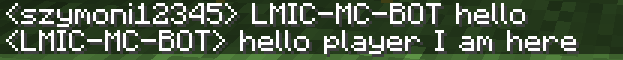

# LMIN-MC-BOT
A Mineflayer-based Minecraft bot integrated with an LLM API for real-time, context-aware chat and navigation.

## Table of contents
- [Supported languages](#supported-languages)
- [Requirements](#requirements)
- [AI models](#ai-models)
- [Bot testing options](#bot-testing-options)
- [Installation](#installation)
- [Running the bot](#running-the-bot)
- [Basic bot mechanics](#basic-bot-mechanics)
- [The bot can](#the-bot-can)
- [Example commands](#example-commands)
- [License](#license)


## Supported languages

- 🇬🇧 English
- 🇵🇱 Polski (Polish)

Want to add your own language? Extend [`languages/languages.js`](./languages/languages.js) with a new locale key following the existing `pl`/`en` structure.

## Requirements
> You need at least one of the following API keys: Groq, Gemini, or HackClub.

### GROQ API
1. Open [console.groq.com](https://console.groq.com) 

2. Click **API Keys** in the left menu.

 

3. Create an API Key.


4. Open the `.env` file and paste the key into `GROQ_FREE_API=`

### GEMINI API

1. Open [aistudio.google.com](https://aistudio.google.com)

2. Click the search icon (bottom-left).


3. Type **API** and click Enter.


4. Click **Create Key**.


5. Copy the API Key. Open the `.env` file and paste it into `GEMINI_FREE_API=`

### HackClub API 

> **Note:** Hack Club AI is free, but only available to teens with a Hack Club account.

1. Open [ai.hackclub.com](https://ai.hackclub.com) if you have an account.

2. Click **Keys**.


3. Click **Create New Key** and copy the API Key.


4. Open the `.env` file and paste it into `HACKCLUB_FREE_API=`

## AI models
| Provider | Models |
|---|---|
| Groq | gpt-oss-120b, gpt-oss-20b, qwen3.6-27b |
| Gemini | gemini-2.5-flash, gemini-2.5-flash-lite |
| HackClub | llama-3.3-70b-instruct |

## Bot testing options
Since I don't have a stable 24/7 hosting, you can run the Minecraft server locally to test the bot:

1. Install [Java](https://oracle.com/java/technologies/downloads/)

2. Go to repository folder `test-minecraft-server-paper-26.2`

3. Run the server: `java -jar paper-26.2-111.jar` and wait for **Done!** in the console.

| **Server parameter** | **Value** |
|:---:|:---:|
| Authentication | Offline |
| Port | 25565 |
| Version | Paper 26.2 |
| Plugins | ViaVersion, ViaBackwards |


## Installation
```
git clone https://github.com/Nahida4479/LMIN-MC-BOT.git
cd LMIC-MC-BOT
npm install

```
Create a .env file in the project folder:
```
BOT_NAME=LMIC-MC-BOT
SERVER=localhost       # for example localhost
SERVER_PORT=25565      # Default 25565              

GEMINI_FREE_API=
GROQ_FREE_API=
HACKCLUB_FREE_API=
```

## Running the bot

```
node mcbot.js
```

## Basic bot mechanics
> The bot responds to commands after being tagged.

- The bot follows the player who last tagged it.
- General chat replies are grounded in the bot's real inventory and surroundings, so it won't claim to have items it doesn't actually have
- Bot has auto reconnect system to server added in `.env`
- The AI response where player tagged bot:



## The bot can
- Kills nearby monsters (protects the player from them)


- Follows the player and breaks blocks

- Delivers gathered resources directly to the player who requested them


- Auto-equips the best armor set available whenever it picks up new gear


## Example commands

Tag the bot's name anywhere in your message, in English or Polish:

| What you want | Example |
|---|---|
| Gather resources | `LMIC-MC-BOT collect 10 oak_log` / `LMIC-MC-BOT zbierz 10 kamienia` |
| Attack a mob or player | `LMIC-MC-BOT attack zombie` / `LMIC-MC-BOT zaatakuj creeper` |
| Request an item | `LMIC-MC-BOT give me 5 dirt` / `LMIC-MC-BOT daj mi 5 ziemi` |
| Duel the bot | `LMIC-MC-BOT fight me` |
| Stop current combat | `LMIC-MC-BOT stop` |
| Anything else | The bot replies independently using an LLM |


## License
This project is licensed under the [MIT License](./LICENSE).
