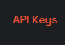
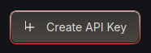
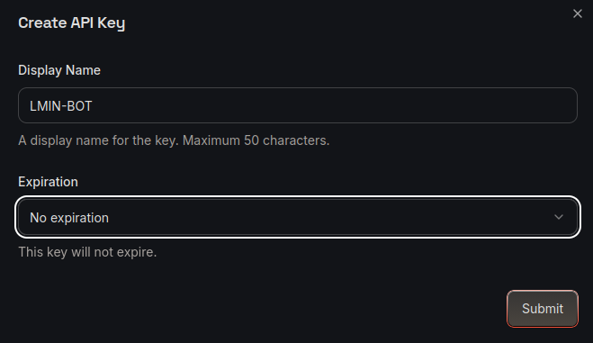
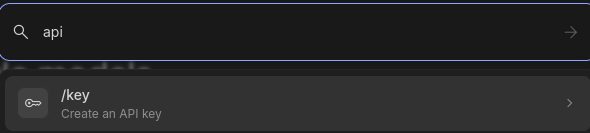
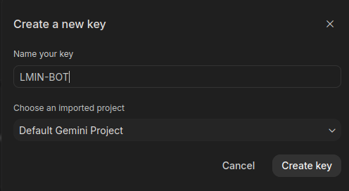
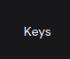

# LMIN-MC-BOT
A Mineflayer-based Minecraft bot integrated with an LLMs API for real-time, context-aware chat and navigation.

## Requirements
> You need at least one of the following API keys: Groq, Gemini, or HackClub.

### GROQ API
1. Open [console.groq.com](https://console.groq.com) 

2. Click **API Keys** in the left menu.

 

3. Create an API Key.

4. Open the `.env` file and paste the key into `GROQ_FREE_API=`

### GEMINI API

1. Open [aistudio.google.com](https://aistudio.google.com)

2. Click the search icon (bottom-left).

3. Type **API** and click Enter.

4. Click **Create Key**.

5. Copy the API Key. Open the `.env` file and paste it into `GEMINI_FREE_API=`

### HackClub API 

> **Note:** Hack Club AI is free, but only available to teens with a Hack Club account.

1. Open [ai.hackclub.com](https://ai.hackclub.com) if you have an account.

2. Click **Keys**.

3. Click **Create New Key** and copy the API Key.

4. Open the `.env` file and paste it into `HACKCLUB_FREE_API=`

## AI models
## AI models
| HackClub | Groq | Gemini |
|---|---|---|
| llama-3.3-70b-instruct | llama-3.3-70b-versatile | gemini-2.5-flash |
|  | llama-3.1-8b-instant | gemini-2.5-flash-lite |
|  | gpt-oss-120b |  |
|  | gpt-oss-20b |  |
|  | qwen3.6-27b |  |
